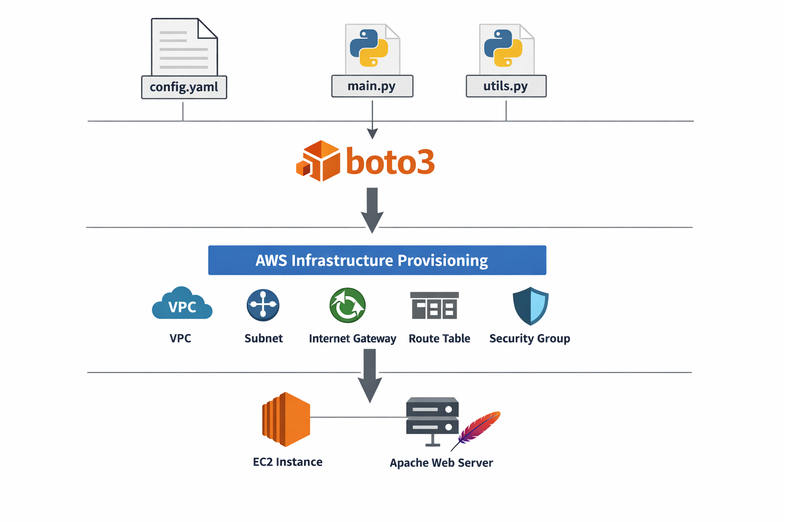
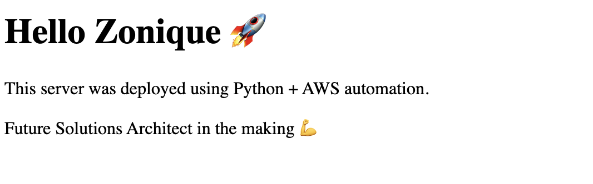

# Cloud Resource Manager

Cloud Resource Manager is a Python-based AWS automation project built with boto3 and YAML configuration.

The project provisions core AWS infrastructure programmatically, including networking, security, and compute resources, then deploys a web server accessible through a public IP.

## What It Builds

The automation creates:

- VPC
- Subnet
- Internet Gateway
- Route Table
- Security Group
- EC2 Instance
- Public IP output
- Apache web server

The infrastructure is idempotent, so running the script multiple times reuses existing resources instead of creating duplicates.

## Architecture

```text
config.yaml
    ↓
main.py + utils.py
    ↓
boto3
    ↓
AWS Infrastructure
(VPC → Subnet → Internet Gateway → EC2)
```



## 📸 Live Demo

This web server is automatically deployed during infrastructure provisioning.



## Design Decisions

- Used boto3 instead of Terraform to get more hands-on experience with the AWS SDK and understand how resources are created programmatically
- Used YAML for configuration so resource settings can be changed without modifying the Python code
- Used a public subnet and Internet Gateway so the EC2 instance and web server could be accessed during testing
- Opened only ports 22 and 80 in the security group to allow SSH and HTTP traffic
- Added idempotent logic so rerunning the script reuses existing infrastructure instead of creating duplicate resources

## Tradeoffs

- boto3 provides more control than Terraform, but it requires more code and resource management
- EC2 provides deeper visibility into infrastructure than serverless services, but it requires more setup and maintenance
- Manual SSH setup was useful for learning, but EC2 User Data would be more scalable and production-friendly
- Public internet access made testing easier, but a production environment would use tighter access controls

## Tech Stack

- Python
- boto3
- PyYAML
- AWS EC2, VPC, IAM

## Project Structure

```text
cloud-resource-manager/
├── config.yaml
├── main.py
├── utils.py
├── requirements.txt
├── README.md
└── .gitignore
```

## Running the Project

```bash
python3 -m venv .venv
source .venv/bin/activate
pip install -r requirements.txt
aws configure
python main.py
```

## Example Output

```text
EC2 public IP: 98.85.100.34
```

Then open:

```text
http://98.85.100.34
```

Expected page:

```text
Hello Zonique 🚀
This server was deployed using Python + AWS automation.
```

## What This Project Demonstrates

- AWS networking and routing
- Infrastructure automation with boto3
- Idempotent resource creation
- EC2 provisioning and management
- Security group configuration
- SSH and remote server management

## Future Improvements

- Use EC2 User Data instead of manual SSH setup
- Automatically assign an Elastic IP
- Attach an IAM role to the EC2 instance
- Deploy a Flask application instead of a static page
- Rebuild the same infrastructure using Terraform